# 혼디 AI 비서 — 사용자 발화 처리 흐름도 (v1.0)

> 근거: `src/gopang/ai/call-ai.js`(callAI → _callAIInner), `src/gopang/ai/manifest-loader.js`
> 작성: 2026-07-13 (레포 직접 분석 기반)

```mermaid
flowchart TD
    A[사용자 발화 입력] --> B{위치정보 대기 중?}
    B -->|Yes, 최대 6초| C[_locationReady 폴링]
    B -->|No| D
    C --> D{maybeHandleExpertTurn<br/>종료 발화 감지}
    D --> E{isExpertActive?<br/>전문가 페르소나 세션 중}
    E -->|Yes 유지| F[applyExpertSystemIfActive<br/>페르소나 SP 유지, history 공유]
    E -->|No| G{CFG.system_base<br/>최초 로드됨?}
    G -->|No| H["_loadAgentCommonSP<br/>manifest-loader._loadSpByKey<br/>UNIVERSAL-INTEGRITY 자동 선접합"]
    G -->|Yes 캐시됨| I[CFG.system 사용]
    H --> I

    F --> J
    I --> J{이미지 첨부?}
    J -->|Yes + geminiKey| K[Gemini Vision 분석<br/>→ SP-00 컨텍스트 텍스트로 변환]
    J -->|Yes, vision 미지원 모델| K2[경고 후 텍스트만 처리]
    J -->|No| L[일반 텍스트]
    K --> M
    K2 --> M
    L --> M[_buildEnhancedUserContent<br/>GUID·위치·PDV 컨텍스트 병합]

    M --> N["history 저장 + messages 구성<br/>system(캐시고정) + 최근18턴 + 현재질문"]
    N --> O["_estimateQueryComplexity<br/>→ _resolveHondiTier<br/>(hondi-flash / hondi-pro)"]
    O --> P["_buildCallCandidates<br/>BYOK 프로바이더 순차 → deepseek-default 폴백"]

    P --> Q{"후보 순차 시도<br/>idle timeout(45s)"}
    Q -->|실패 429/402/404/5xx| Q
    Q -->|성공| R[SSE 스트리밍 응답 렌더링]
    R --> S["_anchorGovChain<br/>(fire-and-forget, OpenHash 앵커링)"]

    S --> T1{"PROFILE 태그?<br/>_handleProfileTags"}
    T1 -->|처리됨| END1[반환 - 처리 종료]
    T1 -->|No| T2{"오케스트레이션 태그?<br/>K-Intent/K-Compose/K-Deliver"}
    T2 -->|처리됨| END1
    T2 -->|No| T3{"SP-Author 태그?<br/>_handleSPAuthorTags"}
    T3 -->|처리됨| END1
    T3 -->|No| T4{"GOV_TASK 태그?<br/>_handleGovTaskTags"}
    T4 -->|처리됨| END1
    T4 -->|No| T5{"DEPT_TASK 태그?<br/>_handleDeptTaskTag"}
    T5 -->|처리됨| END1
    T5 -->|No| T6{"CFG.system에<br/>'K-Search' 포함?"}
    T6 -->|Yes| T6a{"K-Search STEP3<br/>실행 태그?"}
    T6a -->|처리됨| END1
    T6a -->|No| T6b{"미청구 프로필<br/>생성 태그?"}
    T6b -->|처리됨| END1
    T6b -->|No| T7
    T6 -->|No| T7{"WEB_SEARCH 태그?<br/>_handleWebSearchTag"}
    T7 -->|처리됨| END1
    T7 -->|No| T8["_parseAgentTags<br/>§9 공용 디스패처(GWP 등)"]

    T8 --> T9{"EXPERT 태그+<br/>AGENT-COMMON 활성?"}
    T9 -->|Yes| T9a[handleExpertTag<br/>전문가 페르소나 세션 시작]
    T9 -->|No| T10
    T9a --> T10{"AUTH:Lx 태그?"}
    T10 -->|Yes, 인증레벨 부족| T10a[인증 확인 버튼 표시]
    T10 -->|No/충분| T11
    T10a --> T11["K-Law 백그라운드 감시<br/>(3초 후 비동기 실행)"]
    T11 --> END2[턴 종료]
```

## 흐름 요약

- **SP 결정**: `isExpertActive()`로 전문가 페르소나 세션과 일반 AGENT-COMMON을 먼저 분기하고,
  AGENT-COMMON은 세션당 1회만 로드되며 `manifest-loader.js`가 `UNIVERSAL-INTEGRITY`를
  자동으로 앞에 붙인다(2026-07-12 신설 — 서버 사이드에만 강제 주입되고 클라이언트 SP 로드
  경로엔 빠져 있던 버그 수정).
- **모델 선택**: LLM 호출 전에 `_estimateQueryComplexity`가 휴리스틱 점수로
  `hondi-flash`/`hondi-pro`를 자동 결정하고, `_buildCallCandidates`가 BYOK 프로바이더 →
  고팡 프록시 순으로 페일오버 후보를 만든다.
- **태그 디스패치 체인**: 응답 스트리밍 완료 후 `PROFILE → 오케스트레이션 → SP-Author →
  GOV_TASK → DEPT_TASK → (K-Search 게이트) → WEB_SEARCH → _parseAgentTags → EXPERT → AUTH`
  순서로 순차 검사하며, 각 핸들러가 태그를 처리하면 즉시 반환(early return)한다.
  K-Search 관련 두 핸들러만 `CFG.system.includes('K-Search')`로 게이트가 걸려 있다.
