# K-Market 통합 아키텍처 마스터 문서 v1.0

**작성** AI 설계 검토 세션 종합 (2026-07-20) · **범위** 39개 개선 항목 전체
**전제** Supabase 폐기, L1 PocketBase(지역 샤딩) 전환 완료 기준
**연관 문서** `docs/K-Market_WhitePaper_v1_1.md`, `docs/업체_등록_매뉴얼_및_표준.md`, `docs/seller_products_pocketbase_schema.md`

---

## 0. 이 문서의 목적과 읽는 법

이 문서는 순서표(1~39번)에 따라 개별 설계된 항목들을 하나의 아키텍처로 통합한 것입니다. 각 절은 다음을 담습니다.

1. **마스터 다이어그램** — 5개 레이어(0단계 법적 최소요건 ~ 4단계 거버넌스/지속가능성)에 39개 항목이 어떻게 배치되는지, 그리고 레이어 간 의존관계
2. **전체 스키마 관계도** — 39개 항목 설계 과정에서 파생된 모든 PocketBase 컬렉션·KV 네임스페이스·Durable Object의 관계
3. **공통 인프라 컴포넌트** — 여러 항목이 재사용하는 패턴(L1 레지스트리, DO 직렬화, 훅 컨벤션, 앵커링)
4. **레이어별 요약표** — 항목별 핵심 산출물과 상태
5. **미결 트레이드오프 총람**
6. **롤아웃 마스터 타임라인**

실제 코드 작성 시에는 이 문서를 목차 삼아, 4절의 요약표에서 항목을 찾아 해당 세부설계(대화 기록의 해당 절)를 참조하십시오.

---

## 1. 마스터 다이어그램 — 레이어 구조와 의존관계

```mermaid
flowchart TB
    subgraph L0["0단계 · 법적 최소요건"]
        I1["1. KYC 사업자 진위검증"]
        I2["2. 청약철회·환불정책 고지"]
        I3["3. 개인정보처리방침 문서화"]
        I4["4. 위생등급 등 공적 인증연동"]
        I5["5. 다크패턴 금지 + 취소UI"]
        I6["6. 취약계층 보호정책"]
    end

    subgraph L1["1단계 · 신뢰 인프라"]
        subgraph L1M["돈"]
            I7["7. 에스크로(GDC)"]
            I8["8. 결제수단 다양화(PG)"]
            I9["9. 재무제표 위변조 방지"]
        end
        subgraph L1R["평판"]
            I10["10. 리뷰 작성·조작방지"]
            I11["11. 사기·이상거래 탐지"]
        end
        subgraph L1D["분쟁"]
            I12["12. 분쟁해결 실효성(K-Law)"]
        end
    end

    subgraph L2["2단계 · 사용자 경험"]
        I13["13. 위치+시간 검색필터"]
        I14["14. 실시간 배송사 연동"]
        I15["15. 고객-사업자 직접소통"]
        I16["16. 음성·화상 소통"]
        I17["17. 결제 접근성 개선"]
        I18["18. 사업주 실시간 알림"]
    end

    subgraph L3["3단계 · 지능형 고도화"]
        I19["19. 경영자문 고도화"]
        I20["20. 업종별 벤치마킹"]
        I21["21. 세무·노무 리스크 경고"]
        I22["22. 재무제표 기반 신용평가"]
        I23["23. 공정가격 검증"]
        I24["24. 알고리즘 투명성"]
        I25["25. 재무제표 이벤트기반 갱신"]
        I26["26. 비용연동 차등수수료"]
    end

    subgraph L4["4단계 · 거버넌스 / 지속가능성 / 시장성숙"]
        I27["27. 보안감사·침투테스트"]
        I28["28. AML 모니터링"]
        I29["29. 세금계산서 자동발행"]
        I30["30. 데이터 이동권"]
        I31["31. 장애대응 SLA"]
        I32["32. 다국어·접근성"]
        I33["33. 지역경제 순환"]
        I34["34. 디지털 격차 해소"]
        I35["35. 환경영향 고려"]
        I36["36. 공적기구 연계"]
        I37["37. 판매자 피드백 루프"]
        I38["38. 유동성·네트워크효과"]
        I39["39. 플랫폼 존속성 대비"]
    end

    L0 --> L1M
    L0 --> L1R
    I7 --> I8
    I9 -.해시체인 원본.-> I19
    I9 -.해시체인 원본.-> I22
    I9 -.해시체인 원본.-> I25
    I9 -.해시체인 원본.-> I29
    I10 -.신뢰가능 리뷰 데이터.-> I11
    I10 -.평점 데이터.-> I23
    I11 -.신호 재사용.-> I28
    I7 --> I12
    I7 -.배송조건.-> I14
    I13 --> L2
    L1 --> L3
    I19 --> I37
    I20 --> I22
    I20 --> I23
    I22 --> I24
    I13 --> I24
    I14 --> I35
    I15 --> I16
    I8 --> I17
    I18 -."공통 알림 허브".-> I1
    I18 -.-> I9
    I18 -.-> I11
    I18 -.-> I14
    I9 --> I27
    I7 --> I27
    I30 --> I39
    L3 --> L4

    classDef layer0 fill:#fee2e2,stroke:#dc2626
    classDef layer1 fill:#fef3c7,stroke:#d97706
    classDef layer2 fill:#dbeafe,stroke:#2563eb
    classDef layer3 fill:#dcfce7,stroke:#16a34a
    classDef layer4 fill:#ede9fe,stroke:#7c3aed
    class I1,I2,I3,I4,I5,I6 layer0
    class I7,I8,I9,I10,I11,I12 layer1
    class I13,I14,I15,I16,I17,I18 layer2
    class I19,I20,I21,I22,I23,I24,I25,I26 layer3
    class I27,I28,I29,I30,I31,I32,I33,I34,I35,I36,I37,I38,I39 layer4
```



**읽는 법**: 실선 화살표(`-->`)는 레이어 간 진행 순서, 점선 화살표(`-.->`)는 "이 항목의 산출물을 다른 항목이 데이터로 재사용"하는 관계입니다. **9번(재무제표 무결성)과 18번(알림 허브)이 가장 많은 점선이 몰리는 허브**라는 점이 이 다이어그램에서 가장 중요한 사실입니다 — 두 항목을 먼저 안정화해야 후속 항목들의 재작업 리스크가 낮아집니다.

---

## 2. 전체 스키마 관계도

39개 항목 설계에서 파생된 모든 저장소(PocketBase 컬렉션 · Cloudflare KV · Durable Object)를 통합했습니다. PocketBase 컬렉션은 **판매자 소재지 L1 노드**에 위치(별도 표기 없는 한), KV/DO는 전역입니다.

```mermaid
erDiagram
    profiles ||--o{ business_verifications : "guid"
    profiles ||--o{ escrow_holds : "seller_guid/buyer_guid"
    profiles ||--o{ fs_ledger : "guid"
    profiles ||--o{ reviews : "buyer_guid/seller_guid"
    profiles ||--o{ account_risk_score : "guid"
    profiles ||--o{ direct_threads : "buyer_guid/seller_guid"
    profiles ||--o{ owner_notifications : "seller_guid"
    profiles ||--o{ dispute_cases : "via escrow_holds"

    business_verifications ||--o{ business_verification_log : "guid"

    escrow_holds ||--o| dispute_cases : "hold_id"
    escrow_holds ||--o| reviews : "tx_id (1:1)"
    escrow_holds }o--|| payment_provider_config : "pg_provider"
    escrow_holds ||--o{ fs_ledger : "released 시 INSERT"
    escrow_chain_state ||--|| escrow_holds : "gopang-escrow 계정 상태"

    fs_ledger ||--o{ fs_ledger_corrections : "original_tx_id"
    fs_ledger ||--o{ fs_ledger_anchor_flags : "entry_hash"
    fs_ledger }o--|| industry_benchmarks : "occupation 집계"
    fs_ledger ||--o{ tax_invoices : "revenue 레코드"

    reviews ||--o{ review_helpful_votes : "review_id"
    reviews ||--o{ review_moderation_log : "review_id"

    fraud_signals }o--o{ fraud_cases : "signal_ids"
    fraud_cases }o--o{ account_risk_score : "subject_guids"
    fraud_signals }o--|| fs_ledger : "wash_trading 그래프 원본"
    fraud_signals }o--|| reviews : "review_burst 원본"

    dispute_cases }o--|| escrow_holds : "hold_id"

    search_index }o--|| profiles : "guid (파생 색인)"
    search_index }o--|| business_verifications : "kyc_status 동기화"
    search_index }o--|| reviews : "rating_avg/review_count 동기화"

    call_logs }o--|| direct_threads : "thread_id"

    profiles {
        text guid PK
        text l1_node
        json extra "kyc_status 등 병합필드"
    }
    business_verifications {
        text guid FK
        text verify_status
        text b_no
    }
    escrow_holds {
        text tx_id PK
        text buyer_guid FK
        text seller_guid FK
        text status
        text payment_rail
    }
    fs_ledger {
        text tx_id PK
        text guid FK
        number seq
        text entry_hash
        text prev_entry_hash
        bool anchored
    }
    reviews {
        text tx_id PK_FK "escrow_holds 1:1"
        text buyer_guid FK
        number rating
        text status
    }
    fraud_cases {
        text case_status
        text risk_level
        json subject_guids
    }
    account_risk_score {
        text guid PK
        number current_score
        text trust_level
    }
    dispute_cases {
        text hold_id FK
        text ai_verdict
        text human_verdict
    }
    search_index {
        text guid PK
        number lat
        number lng
        number rating_avg
        text kyc_status
    }
```

### 2.1 전역(KV/DO) 저장소 — ER 다이어그램 밖 별도 정리

| 저장소 | 종류 | 소유 항목 | 용도 |
|---|---|---|---|
| `L1_REGISTRY_KV` | Workers KV | 선행종속(A절) | `l1_node → base_url/좌표/서비스반경/record_count/search_perf` |
| `PENDING_REGION_KV` | Workers KV | 선행종속(B절) | 아직 L1이 없는 지역의 등록 대기열 |
| `SHARED_ATTR_INDEX` | Workers KV | 11번 | 대표자명/디바이스/계좌 해시 → 공유 계정 역색인 |
| `OPS_ALERTS_KV` | Workers KV | 선행종속(FTS5) · 8번 · 9번 · 11번 공용 | 운영자 검토 필요 플래그(자동조치 아님) |
| `EscrowSigner` | Durable Object (id=l1_node) | 7번 | 에스크로 계정 릴리즈/환불 서명 직렬화 |
| `LedgerWriter` | Durable Object (id=guid) | 9번 | 사업자별 `fs_ledger` INSERT 순번 직렬화 |
| `CallSignaling` | Durable Object (id=room_id) | 16번 | WebRTC 시그널링 |

---

## 3. 공통 인프라 컴포넌트 — 재사용 패턴 요약

여러 항목이 반복적으로 의존한 5가지 패턴입니다. 코드 작성 시 **이 5개를 가장 먼저 공용 모듈로 확정**하는 것을 권장합니다.

| 패턴 | 최초 정의 항목 | 재사용한 항목 |
|---|---|---|
| **L1 레지스트리 조회/팬아웃** (`resolveL1Base`, `nearbyL1Nodes`, `listActiveL1Nodes`) | 선행종속 A절 | 1, 7, 8, 9, 10, 11, 13, 14, 20 |
| **PocketBase 훅 append-only 강제 컨벤션** | 9번 | 10 (리뷰 수정잠금), 향후 모든 원장성 데이터 |
| **Durable Object 계정단위 직렬화** | 7번(EscrowSigner) | 9(LedgerWriter), 16(CallSignaling) |
| **"플래그만, 최종조치는 사람"** 원칙 및 `OPS_ALERTS_KV` | 선행종속(FTS5 트리거) | 8(대사불일치), 9(무결성위반), 11(사기케이스), 27 |
| **`notifyOwner()` 공통 알림 허브** | 18번 | 1, 9, 11, 14, 19, 21 (전부 TODO로 남겼던 지점을 18번이 흡수) |

---

## 4. 레이어별 요약표

### 0단계 · 법적 최소요건

| # | 항목 | 핵심 산출물 | 상태 |
|---|---|---|---|
| 1 | KYC 사업자 진위검증 | `business_verifications`, 국세청 validate/status API 연동, L1별 재검증 크론 | 설계완료 |
| 2 | 청약철회·환불정책 | 7번 에스크로 유예기간(7일)이 기술적 구현체 겸함 | 7번에 흡수 |
| 3 | 개인정보처리방침 문서화 | 법무 문서화 작업 — 코드 설계 범위 밖 | 미착수 |
| 4 | 위생등급 연동 | 식약처 API 연동 — 설계 미착수(1번 KYC와 동일 패턴 적용 가능) | 미착수 |
| 5 | 다크패턴 금지·취소UI | 8번 요율 투명고지, 7번 구매확정/이의제기 버튼이 부분 구현 | 부분 |
| 6 | 취약계층 보호정책 | 17번 비회원 결제 금액상한이 부분 대응 | 부분 |

### 1단계 · 신뢰 인프라

| # | 항목 | 핵심 산출물 | 상태 |
|---|---|---|---|
| 7 | 에스크로(GDC) | `escrow_holds`, `escrow_chain_state`, `EscrowSigner` DO | 설계완료 |
| 8 | 결제수단 다양화 | `PaymentAdapter` 인터페이스, `TossPaymentsAdapter`, 정산대사 크론 | 설계완료 |
| 9 | 재무제표 위변조 방지 | `fs_ledger` 해시체인, append-only 훅, OpenHash 외부 앵커링 | 설계완료 |
| 10 | 리뷰 작성·조작방지 | `reviews` 1:1 tx_id 제약, 이상탐지 크론(급증/유사도/신규계정) | 설계완료 |
| 11 | 사기·이상거래 탐지 | `fraud_signals`/`fraud_cases`, 실시간+배치 이원 탐지 | 설계완료 |
| 12 | 분쟁해결 실효성 | `dispute_cases`, AI 1차판정+사람확정+항소 1회 | 설계완료 |

### 2단계 · 사용자 경험

| # | 항목 | 핵심 산출물 | 상태 |
|---|---|---|---|
| 13 | 위치+시간 검색필터 | `search_index.open_now`, 매시 크론 | 설계완료 |
| 14 | 실시간 배송사 연동 | `/biz/delivery/track`, `escrow_holds.delivery_confirmed_at` | 설계완료 |
| 15 | 고객-사업자 직접소통 | `direct_threads`, 외부거래유도 경고배너 | 설계완료 |
| 16 | 음성·화상 소통 | WebRTC + `CallSignaling` DO | 설계완료 |
| 17 | 결제 접근성 개선 | 비회원 결제 상한, 결제수단 비교 UI | 설계완료 |
| 18 | 사업주 실시간 알림 | `owner_notifications`, `notifyOwner()` 공통 허브 | 설계완료 |

### 3단계 · 지능형 고도화

| # | 항목 | 핵심 산출물 | 상태 |
|---|---|---|---|
| 19 | 경영자문 고도화 | 주간 재무진단 크론 + AI 제안(초안only) | 설계완료 |
| 20 | 업종별 벤치마킹 | `industry_benchmarks`(표본<5 비공개 규칙) | 설계완료 |
| 21 | 세무·노무 리스크 경고 | 간이과세 기준 초과 감지 등 | 설계완료 |
| 22 | 재무제표 기반 신용평가 | `trust_level` 산식(가중치 비공개) | 설계완료 |
| 23 | 공정가격 검증 | 동종상품 중위값 비교, 가성비지수 실화 | 설계완료 |
| 24 | 알고리즘 투명성 | 검색/신용등급 "대분류 기여도" 공개 | 설계완료 |
| 25 | 재무제표 이벤트기반 갱신 | PocketBase Realtime 발행(구독측은 범위밖) | 설계완료(발행측만) |
| 26 | 비용연동 차등수수료 | 기본요율+사용량가산(상한 캡) 하이브리드 | 설계완료 |

### 4단계 · 거버넌스 / 지속가능성 / 시장성숙

| # | 항목 | 핵심 산출물 | 상태 |
|---|---|---|---|
| 27 | 보안감사·침투테스트 | 분기 점검, 자산규모 트리거 연동 | 정책 수립 |
| 28 | AML 모니터링 | `fraud_signals.aml_structuring`(11번 재사용) | 설계완료(신고절차는 법무검토 필요) |
| 29 | 세금계산서 자동발행 | `tax_invoices`, 초안+수동승인 | 설계완료 |
| 30 | 데이터 이동권 | `/biz/export-my-data`, 9번 서명 재사용 | 설계완료 |
| 31 | 장애대응 SLA | L1 팬아웃 장애흡수 문서화, RTO 표 | 정책 수립 |
| 32 | 다국어·접근성 | 다국어 색인 필드, ARIA — 해외 KYC는 별도 프로젝트 | 부분 |
| 33 | 지역경제 순환 | 검색가점 요소(24번과 연동) | 설계완료 |
| 34 | 디지털 격차 해소 | 오프라인 지원 창구 — 운영정책 | 정책 수립 |
| 35 | 환경영향 고려 | 합배송 제안(14번 데이터 기반) | 유보(데이터 축적 후) |
| 36 | 공적기구 연계 | 익명화 리포트 export(자동신고 아님) | 설계완료 |
| 37 | 판매자 피드백 루프 | A/B 테스트 인프라(19번 상위호환) | 유보(표본 확보 후) |
| 38 | 유동성·네트워크효과 | 콜드스타트 인센티브, 리퍼럴(10번 패턴 재사용) | 정책 수립 |
| 39 | 플랫폼 존속성 대비 | 자금청산 절차 문서화(30번 확장) | 정책 수립 |

---

## 5. 미결 트레이드오프 총람

코드 작성 전 팀 차원의 결정이 필요한 항목만 모았습니다.

| 항목 | 쟁점 | 현재 잠정 결론 |
|---|---|---|
| 7 | 에스크로 개인키를 Worker Secret vs KMS | 파일럿은 Secret, 자금규모 임계치 도달 시 KMS 전환 |
| 9 | 앵커링 권한과 L1 admin 권한 분리 시점 | Phase 2로 유보, 지금은 이중 기록으로 완화 |
| 선행종속 | `search_index` 직접 노출 여부 | **비노출 결정** (오케스트레이션 로직 중복 우려) |
| 선행종속 | FTS5 조기 전환 여부 | **계측 후 트리거**(10,000건/300ms) — `virtual` 노드는 예외 |
| 22 vs 24 | 신용평가 가중치 공개 범위 | "무엇을 보는지는 공개, 얼마나 반영하는지는 비공개" |
| 26 | 완전 원가연동 vs 균일요율 | 하이브리드(기본요율+사용량가산 상한 캡) |
| 12 | AI 자동판정 금액 상한 | 파일럿 데이터로 추후 확정, 원칙은 "낮게" |

---

## 6. 롤아웃 마스터 타임라인 (개념적 순서, 실제 스프린트 배분은 별도)

```mermaid
gantt
    title K-Market 39개 항목 롤아웃 개념 순서
    dateFormat  X
    axisFormat %s

    section 0단계 법적요건
    KYC(1)/청약철회(2)/개인정보(3)      :a1, 0, 3
    위생연동(4)/다크패턴(5)/취약계층(6)  :a2, 2, 3

    section 1단계 신뢰인프라
    에스크로(7)                         :b1, 4, 3
    결제다양화(8)                       :b2, 6, 2
    재무무결성(9)                       :b3, 4, 3
    리뷰작성(10)                        :b4, 7, 2
    사기탐지(11)                        :b5, 8, 3
    분쟁실효성(12)                      :b6, 10, 2

    section 2단계 UX
    검색필터(13)/배송연동(14)           :c1, 11, 2
    직접소통(15)/음성화상(16)           :c2, 12, 2
    결제접근성(17)/알림허브(18)         :c3, 12, 2

    section 3단계 지능형
    경영자문(19)/벤치마킹(20)           :d1, 14, 3
    세무경고(21)/신용평가(22)           :d2, 16, 3
    공정가격(23)/투명성(24)             :d3, 17, 2
    실시간갱신(25)/차등수수료(26)       :d4, 18, 2

    section 4단계 거버넌스
    보안(27)/AML(28)/세금계산서(29)     :e1, 19, 3
    이동권(30)/SLA(31)/접근성(32)       :e2, 20, 3
    지속가능성(33-39)                   :e3, 22, 4
```



---

## 7. 다음 작업 제안

이 문서를 목차로 삼아 실제 구현에 들어갈 때는 다음 순서를 권장합니다.

1. **공용 모듈부터**: 3절의 5개 패턴(L1 레지스트리, 훅 컨벤션, DO 직렬화, 알림허브, OPS_ALERTS_KV)을 `worker/lib/`에 먼저 구현
2. **9번(재무 무결성) → 7번(에스크로) → 10번(리뷰)** 순으로 1단계 착수 (의존관계상 9번이 다른 항목의 데이터 원본이므로 최우선)
3. 이후 0단계 법적요건(특히 1·2번)을 병행 — 법적 리스크는 기술 순서와 무관하게 조기 착수 필요

---

*본 문서는 대화 세션 중 도출된 39개 설계를 통합한 것으로, 실제 코드 작성 전 팀 리뷰를 거쳐야 합니다.*
