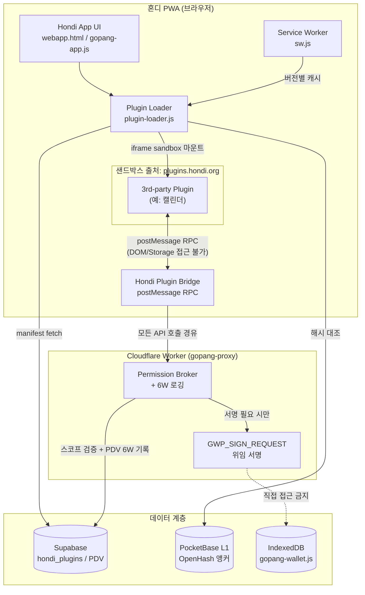

# 혼디(Hondi) 슬라이드 메뉴 SKIN 선택 + 플러그인 생태계 아키텍처 제안서

**대상 프로젝트:** 혼디(Hondi, 구 고팡) — Jeju Island 시민 슈퍼앱 PWA
**작성 목적:** (1) 슬라이드 메뉴 SKIN/UX 선택 기능, (2) 캘린더 등 플러그인 추가 시 보안 우려와 해법, (3) 플러그인/익스텐션 생태계 아키텍처 제안
**전제:** 기존 허브-앤-스포크 원칙, PDV는 Worker를 통해서만 기록, 6W 원칙, OpenHash 앵커링은 Worker의 단독 책임이라는 6대 원칙을 그대로 계승·확장한다.

---

## 1부. 슬라이드 메뉴 SKIN 선택 기능 (settings.js 확장)

### 1.1 제안 SKIN 5종 (첨부 이미지 기반 매핑)

| ID | 명칭 | 특징 | 참고 이미지 |
|---|---|---|---|
| `editorial` | 에디토리얼 (뉴스형) | 좌측 풀블리드 컬러 바 + 단순 텍스트 리스트, X 닫기 버튼 | Image 1 |
| `gradient-chat` | 그라디언트 메신저형 | 보라→파랑 그라디언트 헤더 + 아이콘 동반 리스트 | Image 6 |
| `productivity` | 생산성 캘린더형 | 화이트 패널 슬라이드오버, 섹션 구분선 + 체크 항목 | Image 7 |
| `minimal-profile` | 미니멀 프로필형 | 상단 프로필 카드(아바타+이메일) + 단색 리스트 | Image 8 |
| `travel-card` | 트래블 카드형 | 라운드 컬러 패널 + 프로필 + 구분선 + 하단 로그아웃 | Image 9 |

각 SKIN은 색상/도형/타이포만 다르고 **DOM 구조와 인터랙션 로직은 동일**하게 유지하는 것이 핵심이다. 이렇게 해야 5종을 유지보수하는 비용이 1종 유지보수 비용과 거의 같아진다.

### 1.2 구현 방식: CSS Custom Properties + `data-menu-skin` 스위칭

5개의 CSS 파일을 따로 만들지 않고, **CSS 변수 토큰 + 단일 `skins.css`**로 구현한다. PWA 캐시 부담을 최소화하고 `sw.js` 캐시 버전 관리도 단순해진다.

```css
/* skins.css */
:root {
  --menu-shape: panel;        /* bar | panel | card */
  --menu-bg: #ffffff;
  --menu-fg: #121212;
  --menu-accent: #3079ef;
  --menu-radius: 0px;
}

[data-menu-skin="editorial"] {
  --menu-shape: bar;
  --menu-bg: #2f7dde;
  --menu-fg: #ffffff;
  --menu-accent: #2bd9b9;
  --menu-radius: 0px;
}

[data-menu-skin="gradient-chat"] {
  --menu-shape: panel;
  --menu-bg: linear-gradient(160deg, #7b5cf0, #4a4ad6);
  --menu-fg: #ffffff;
  --menu-accent: #ffffff;
  --menu-radius: 24px;
}

[data-menu-skin="productivity"] {
  --menu-shape: panel;
  --menu-bg: #ffffff;
  --menu-fg: #1a1a1a;
  --menu-accent: #6c4ce0;
  --menu-radius: 16px;
}

[data-menu-skin="minimal-profile"] {
  --menu-shape: panel;
  --menu-bg: #ffffff;
  --menu-fg: #121212;
  --menu-accent: #2bd9b9;
  --menu-radius: 20px;
}

[data-menu-skin="travel-card"] {
  --menu-shape: card;
  --menu-bg: #5b8a78;
  --menu-fg: #ffffff;
  --menu-accent: #ffffff;
  --menu-radius: 28px;
}

.hondi-slide-menu {
  background: var(--menu-bg);
  color: var(--menu-fg);
  border-radius: var(--menu-radius);
}
.hondi-slide-menu .accent { color: var(--menu-accent); }
```

### 1.3 `settings.js` 추가 코드

```js
// settings.js — 추가분

const MENU_SKINS = [
  { id: 'editorial',       label: '에디토리얼 (뉴스형)',   thumb: '/assets/skins/editorial.svg' },
  { id: 'gradient-chat',   label: '그라디언트 메신저형',   thumb: '/assets/skins/gradient-chat.svg' },
  { id: 'productivity',    label: '생산성 캘린더형',       thumb: '/assets/skins/productivity.svg' },
  { id: 'minimal-profile', label: '미니멀 프로필형',       thumb: '/assets/skins/minimal-profile.svg' },
  { id: 'travel-card',     label: '트래블 카드형',         thumb: '/assets/skins/travel-card.svg' },
];

const DEFAULT_SKIN = 'editorial';
const SKIN_STORAGE_KEY = 'hondi_menu_skin';

/**
 * FOUC 방지를 위해 동일 로직을 <head> 인라인 스크립트에서도
 * 1회 먼저 실행해 두는 것을 권장 (localStorage 동기 read만 사용).
 */
function applyMenuSkin(skinId) {
  const valid = MENU_SKINS.some(s => s.id === skinId);
  const finalSkin = valid ? skinId : DEFAULT_SKIN;
  document.documentElement.dataset.menuSkin = finalSkin;
  return finalSkin;
}

function loadMenuSkinPreference() {
  // 1순위: 로컬 캐시 — 즉시 반영 + 오프라인 대응
  const local = localStorage.getItem(SKIN_STORAGE_KEY);
  if (local) applyMenuSkin(local);

  // 2순위: 서버 동기화 — 다중 기기 일관성, Worker 단일 관문 원칙 유지
  fetch(`${WORKER_BASE_URL}/profile/preferences`, {
    headers: { Authorization: `Bearer ${getSessionToken()}` },
  })
    .then(r => r.json())
    .then(data => {
      if (data?.menuSkin && data.menuSkin !== local) {
        localStorage.setItem(SKIN_STORAGE_KEY, data.menuSkin);
        applyMenuSkin(data.menuSkin);
      }
    })
    .catch(() => { /* 오프라인 시 로컬 값 유지 */ });
}

function renderSkinPicker(containerEl) {
  containerEl.innerHTML = MENU_SKINS.map(skin => `
    <label class="skin-option" data-skin-id="${skin.id}">
      <input type="radio" name="menuSkin" value="${skin.id}"
             ${document.documentElement.dataset.menuSkin === skin.id ? 'checked' : ''} />
      
      <span>${skin.label}</span>
    </label>
  `).join('');

  containerEl.addEventListener('change', async (e) => {
    const skinId = e.target.value;
    const finalSkin = applyMenuSkin(skinId); // optimistic — 즉시 화면 반영

    localStorage.setItem(SKIN_STORAGE_KEY, finalSkin);

    try {
      await fetch(`${WORKER_BASE_URL}/profile/preferences`, {
        method: 'PATCH',
        headers: {
          'Content-Type': 'application/json',
          Authorization: `Bearer ${getSessionToken()}`,
        },
        body: JSON.stringify({ menuSkin: finalSkin }),
      });
    } catch (err) {
      console.warn('[settings] skin 서버 동기화 실패, 다음 온라인 시 재시도 필요', err);
    }
  });
}
```

### 1.4 백엔드/캐시 반영 체크리스트

- **Worker(`worker.js`)**: `/profile/preferences` 엔드포인트에 `menuSkin` 필드 추가 (기존 v5.1 `/profile` Ed25519+TOFU 인증 플로우 재사용).
- **Supabase**: `profiles` 테이블에 `menu_skin text default 'editorial'` 컬럼 추가, 또는 별도 `user_preferences` 테이블로 분리.
- **`sw.js`**: `skins.css`와 5개 썸네일 SVG가 `STATIC_ASSETS`에 새로 추가되므로 **`CACHE_NAME` 버전 bump 필요**.
- **첫 방문 게이팅**: 신규 사용자는 `DEFAULT_SKIN`(editorial)으로 시작, 온보딩 단계에서 SKIN 선택을 선택적으로 노출 가능.

---

## 2부. 플러그인(캘린더 등) 추가 시 보안 우려와 Chrome 방식 해법

### 2.1 우려되는 보안 문제점

1. **동일 출처(Same-Origin) 전면 노출** — 혼디 PWA는 단일 출처이므로, 플러그인 JS가 호스트 페이지와 같은 컨텍스트에서 실행되면 `localStorage`, `IndexedDB`(특히 `gopang-wallet.js`의 Ed25519 개인키), 세션 토큰까지 모두 읽을 수 있다. **현재 진행 중인 인증 패치 이전 상태(토큰 unsigned)에서는 탈취된 토큰의 위·변조 검증 자체가 불가능**해 위험도가 한층 더 커진다.
2. **데이터 유출(Exfiltration)** — 캘린더 플러그인이 PDV의 무관한 카테고리(위치, 거래 내역 등)까지 읽어 외부로 전송할 가능성.
3. **권한 크리프(Permission Creep)** — 설치 시엔 "캘린더 읽기"만 요청하다가, 업데이트 후 조용히 권한을 확장하는 공급망 공격(Supply-chain attack) 패턴.
4. **`GWP_SIGN_REQUEST` 위임 패턴 오남용** — 기존 지갑 서명 위임 구조를 플러그인이 직접 호출하면, 사용자 동의 없는 서명 요청이 발생할 위험.
5. **리소스 남용** — PWA 특성상 Service Worker / WebRTC(coturn TURN 포함) 자원을 플러그인이 백그라운드에서 과다 사용 시 모바일 배터리·데이터 소모.
6. **코드 무결성 미검증** — 외부 CDN에서 매번 최신 플러그인 코드를 로드할 경우, 배포 서버가 해킹되면 즉시 전 사용자에게 악성코드가 전파된다.

### 2.2 Chrome Extension(Manifest V3) 모델에서 차용할 해법

| Chrome 메커니즘 | 핵심 아이디어 |
|---|---|
| Isolated Worlds | content script는 페이지의 JS 변수/함수에 직접 접근 불가, 별도 JS 컨텍스트에서 실행 |
| 원격 코드 실행 금지 | `eval()` 및 인라인 스크립트 금지, 엄격한 CSP(`script-src 'self'`) |
| 선언적 권한 + 런타임 동의 | `manifest.json`에 권한 선언, 설치·업데이트 시 명시적 동의 — 권한 확대 시 재동의 |
| 비영속 백그라운드 | 상시 구동 백그라운드 페이지 대신 필요 시에만 깨는 서비스 워커 |
| 스토어 심사 + 서명 | 자동 정적분석 + 수동 심사를 거친 서명된 패키지만 배포 |

### 2.3 혼디 적용 제안 — "Worker 중계 + 샌드박스 iframe" 모델

기존 **허브-앤-스포크 원칙**과 **PDV는 Worker를 통해서만 기록**한다는 원칙을 플러그인 시스템에 그대로 확장한다.

1. **별도 출처(Cross-Origin) 샌드박스 iframe** — 모든 플러그인은 `plugins.hondi.org` 서브도메인에서 `<iframe sandbox="allow-scripts allow-forms">`로 로드. 브라우저의 동일 출처 정책이 강제 적용되어 플러그인은 부모 페이지의 `localStorage`/`IndexedDB`/DOM에 물리적으로 접근 불가.
2. **`postMessage` 기반 RPC만 허용** — 모든 통신은 타입이 정의된 메시지 스키마(Hondi Plugin Bridge)를 통해서만 이루어진다. 직접 함수 호출 불가.
3. **능력 기반 권한 매니페스트(Capability-based permissions)** — `plugin.json`에 정확한 스코프(예: `pdv.read:calendar_events`)를 선언, 설치 시 Chrome 스타일 동의 다이얼로그 노출.
4. **Worker가 모든 API 호출의 단일 관문** — 플러그인은 지갑 키나 PDV에 직접 접근하지 못하고 반드시 Cloudflare Worker(`gopang-proxy`)를 경유한다. Worker는 권한 스코프 검증 + **6W 원칙**(누가/무엇을/언제/어디서/왜/어떻게)에 따른 로깅을 수행. 서명이 필요한 작업은 기존 `GWP_SIGN_REQUEST` 위임 패턴을 그대로 쓰되, 플러그인이 아닌 메인 앱/Worker만 트리거 가능하도록 제한.
5. **무결성 검증에 OpenHash 재사용** — 플러그인 배포 시 번들의 SHA-256 해시를 OpenHash 분산 원장에 앵커링. 로드 시점에 받아온 번들 해시와 앵커된 해시를 대조하여, 변조된 플러그인은 즉시 실행 차단. (기존 OpenHash 인프라의 새로운 활용처)
6. **CSP + Subresource Integrity** — `frame-src plugins.hondi.org`, `script-src 'self'` 등 엄격한 CSP 헤더 적용.
7. **세분화된 Rate Limiting** — Worker 단에서 플러그인별/사용자별 API 호출 쿼터 설정, 비정상 패턴 시 자동 차단.

> **운영 순서 권고:** 현재 진행 중인 인증 보안 패치(전화 OTP + HMAC 토큰 서명)가 선행되지 않은 상태에서 플러그인 생태계를 먼저 여는 것은 공격 표면을 불필요하게 넓히는 일이다. **인증 패치 완료 → 플러그인 시스템 도입** 순서를 권장한다.

---

## 3부. 플러그인/익스텐션 생태계 아키텍처

### 3.1 구성 요소

| 구성 요소 | 위치 | 역할 |
|---|---|---|
| Plugin Manifest (`plugin.json`) | 플러그인 저장소 | id, 버전, entry URL, mountPoints, permissions, 해시/앵커 정보 선언 |
| Plugin Registry | Supabase `hondi_plugins` 테이블 | 등록/심사 상태(pending/approved/revoked), 권한 목록, 버전 이력 |
| Plugin Loader (`plugin-loader.js`) | 클라이언트 | manifest fetch → 해시 검증 → 샌드박스 iframe 마운트 → Bridge 채널 수립 |
| Hondi Plugin Bridge (HPB) | 클라이언트 | `postMessage` 기반 타입드 RPC 프로토콜, `hondi.pdv.*` / `hondi.calendar.*` / `hondi.ui.*` API 노출 |
| Permission Broker | Cloudflare Worker | 호출마다 스코프 검증 + PDV 6W 로깅, 서명 필요 시 `GWP_SIGN_REQUEST` 위임 |
| UI Mount Points | 클라이언트 앱 | `slide-menu-item`, `dashboard-widget`, `settings-panel-section` 등 정해진 슬롯 |
| Service Worker | 클라이언트 | 버전별 플러그인 번들 캐시, 오프라인 대응 |

### 3.2 아키텍처 다이어그램



### 3.3 권한 매니페스트 예시 (`plugin.json`)

```json
{
  "id": "hondi-calendar",
  "name": "혼디 캘린더",
  "version": "1.0.0",
  "entry": "https://plugins.hondi.org/calendar/v1/index.html",
  "mountPoints": ["dashboard-widget", "slide-menu-item"],
  "permissions": [
    "pdv.read:calendar_events",
    "pdv.write:calendar_events",
    "ui.notification"
  ],
  "integrity": {
    "sha256": "•••",
    "openhashAnchorTx": "•••"
  }
}
```

### 3.4 리뷰/거버넌스 프로세스

1. 개발자가 플러그인 번들 + `plugin.json` 제출
2. 정적 분석 — 선언된 권한 스코프 대비 실제 코드의 API 호출 패턴 검사
3. 번들 해시를 **OpenHash 분산 원장**에 앵커링 (배포 시점 무결성 증명)
4. 수동 심사 승인 → `hondi_plugins` 레지스트리에 `approved` 상태로 게시
5. 사용자 설치 시 권한 동의 UI 노출 (Chrome 스타일)
6. 버전 업데이트로 권한 범위가 늘어나면 **재동의 필수**
7. (확장 아이디어) 커뮤니티 공개 플러그인은 추후 K-Democracy의 8단계 숙의 프레임워크를 거버넌스 레이어로 적용 가능 — 단, 1차 구현 범위에서는 우선순위가 낮음

---

## 마무리 / 다음 단계 제안

- **우선순위 1**: SKIN 선택 기능 — `settings.js` + CSS 변수만으로 비교적 빠르게 구현 가능, 리스크 낮음.
- **우선순위 2**: 플러그인 생태계 — 인증 패치(전화 OTP + HMAC 서명) 완료 후 착수 권장. 미완료 상태에서 외부 코드 실행 표면을 넓히는 것은 현재 진행 중인 디바이스 핑거프린트 충돌 이슈와 별개로 또 다른 공격 벡터가 된다.
- 실제 구현 단계로 넘어가면, `worker.js` / `settings.js` / `sw.js` 각각의 실제 diff와 git/PowerShell 커맨드를 표준 워크플로우에 맞춰 별도로 정리해 드릴 수 있습니다.
