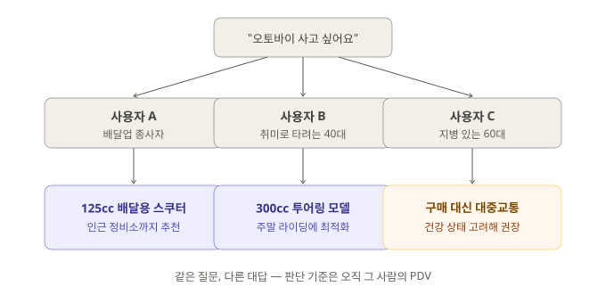

# 혼디마켓

> **초안 v0.1** · 2026-08-22 · 검토용 — 기존 `pages/hondi-market.html`(개발자 대상 "혼디장 — AI Webapp 마켓플레이스")을 완전히 대체
> 참고 자료: `worker.js`(handleCatalogSync/Get, finance 스키마), `src/gopang/ui/welcome.js`(_forwardProductsToMarket), `docs/gdc_commerce_completion_plan_v0_1.md`, `docs/gopang_whitepaper.md` §4-3, `docs/gopang_repo_structure_v1.0.md`, `github.com/Openhash-Gopang/market` 저장소

---

## 혼디마켓은 무엇이 다른가

쿠팡·네이버쇼핑 같은 기존 이커머스 플랫폼은 결국 **플랫폼 자신의 이익**을 최우선에 둡니다. 검색 노출 순위에 광고비가 반영되고, 수수료는 플랫폼의 주요 수익원이며, 데이터는 플랫폼 서버에 쌓여 플랫폼의 자산이 됩니다.

혼디마켓은 다릅니다. 혼디에는 주주도, 외부 투자자도 없습니다. **오직 구매자와 판매자의 이익을 위해 복무**하도록 설계되어 있습니다.

| 구분 | 기존 이커머스 | 혼디마켓 |
|---|---|---|
| 우선순위 | 플랫폼의 수익 극대화 | 구매자·판매자의 이익 |
| 거래 수수료 | 매출의 상당 비율(통상 5~15%대) | 거래당 극소액(₮0.001 수준) — 인프라 유지 목적만 |
| 검색 노출 | 광고비 지불 시 상위 노출 가능 | 광고 노출 로직 자체가 없음 — 평판·신뢰도 기반 |
| 거래 데이터 | 플랫폼 서버에 귀속 | 구매자·판매자 각자의 기기(PDV)에 귀속 |
| 수익 배당 | 주주에게 배당 | 배당 구조 없음 — 수수료를 최소화할 이유만 있음 |

> 혼디의 운영 비용은 극소액의 거래 수수료와 API 사용료로 충당됩니다. 배당할 주주가 없기 때문에, 수수료를 높일 이유 자체가 없습니다.

---

## 구매자에게 — 나만 아는 나를 기억하는 쇼핑

혼디마켓의 검색은 다른 이커머스와 결과 자체가 다릅니다. 혼디는 사용자의 **과거 구매 이력, 상품·서비스에 대한 평가, 생활 습관, 직업, 소득 수준, 심지어 과거 병력과 가족 관계**까지 PDV(프라이빗 데이터 금고)에 기록해두고 있어, 지금 이 사람에게 무엇이 진짜 적합한지 가장 잘 판단할 수 있는 위치에 있습니다.

**그 결과, 1만 명이 같은 상품을 검색해도 혼디는 1만 명에게 제각기 다른 답을 줄 수 있습니다.**

예를 들어 오토바이를 구매하려는 사용자가 있다고 해봅시다. 혼디는 다음을 종합적으로 고려합니다.

- 생활 습관과 직업 — 배달 등 업무용인지, 주말 취미용인지
- 운동 신경과 과거 병력 — 안전하게 다룰 수 있는 배기량인지
- 소득 수준 — 무리 없는 가격대인지
- 가족 관계 — 부양가족이 있어 사고 위험을 더 보수적으로 봐야 하는지

이를 바탕으로 혼디는 **배기량·제조사·사후 수리 서비스까지 고려한 최적의 오토바이를 추천**하거나, 상황에 따라서는 **아예 구매를 자제하도록 조언**할 수도 있습니다. 무엇을 팔지가 아니라 무엇이 이 사람에게 실제로 필요한지를 기준으로 삼기 때문에 가능한 일입니다.



> 이런 방식의 추천은 기존 이커머스에는 없던 것입니다. 대부분의 쇼핑 플랫폼은 클릭 유도와 매출 극대화를 기준으로 상품을 추천합니다. 혼디는 그 상품이 실제로 이 사람에게 필요한지를 기준으로 삼습니다 — 심지어 "사지 마세요"라는 결론도 낼 수 있는 추천 시스템입니다.

---

## 판매자에게 — 전속 경영 전문가 그룹을 두는 것과 같습니다

혼디마켓의 판매자에게 혼디는 단순한 판매 창구가 아닙니다. 고객 리뷰, 주변 상권의 경쟁 밀집도, 업종별 성장·퇴조 흐름을 종합적으로 판단해 경영 진단과 자문을 제공합니다 — **최고의 경영 전문가 그룹이 매 판매자마다 전속으로 배정된 것**과 같습니다.

- **상권 분석** — 공공데이터(소상공인시장진흥공단 상가정보) 기반으로 반경 내 경쟁 업체 밀집도를 실측 데이터로 확인합니다.
- **마케팅 방안 제안** — 등록된 상품 카탈로그와 상권 데이터를 근거로, 이 업체에 맞는 마케팅 방안을 제안합니다.
- **리뷰 답글 자동 작성** — 고객이 남긴 리뷰에 사장님을 대신할 답글 초안을 작성합니다.
- **재고관리(JIT)** — 최근 판매 속도를 분석해 재주문 시점을 알아서 계산합니다. 재고가 떨어지고 나서야 알아채는 일이 없습니다.
- **공급망·인사·채용·직원 일정관리** — 직원 채용, 업무 배정, 일정 관리까지 하나의 창구에서 처리합니다.

### 회계·세무 부담을 줄입니다

혼디는 판매자의 거래 내역을 바탕으로 재무제표를 자동으로 생성·갱신합니다. 국세청이 관련 API를 개방하는 시점부터는 최적의 세금 계획을 수립하고 납부까지 대행하는 것을 목표로 하고 있어, 업체마다 부담하던 회계사·세무사 비용을 크게 줄일 수 있습니다.

> [!NOTE]
> 세금 계획 수립·납부 대행은 국세청 API 개방을 전제로 하는 목표입니다. 현재는 매출 통계를 세무 신고의 참고 자료로 제공하는 수준이며, 실제 신고서 작성·제출은 홈택스를 통해 직접 하시거나 세무사와 상담하셔야 합니다.

### 혼디만이 줄 수 있는 것 — 데이터가 한곳에 모이지 않는다는 안전함

기존 이커머스에서 고객 데이터를 다루는 판매자는 그 자체로 개인정보 유출의 책임을 떠안습니다. 혼디마켓에서는 고객의 구매 이력·평가가 혼디 서버가 아니라 **고객 각자의 기기(PDV)**에 흩어져 있습니다. 판매자는 그 데이터를 직접 모아 보관하지 않고도 혼디를 통해 통찰을 얻을 수 있어, 대규모 유출 사고의 책임 자체를 구조적으로 지지 않습니다.

---

## 상품 등록 — 양식이 아니라 대화로

혼디마켓에서 상품을 등록하는 방법은 다른 이커머스와 근본적으로 다릅니다. **복잡한 판매자 센터 양식을 채우지 않습니다.** 자신의 AI 비서에게 사업과 상품을 이야기하기만 하면 됩니다.

```
"홍성방이라는 중국집을 운영하고 있고, 짜장면은 6천원, 짬뽕은 7천원이야."
    ↓
AI 비서가 대화 중 상품 정보를 자동으로 구조화
    ↓
판매자 서명(본인 인증) 후 혼디마켓에 자동 등록
    ↓
다른 사용자의 검색에 즉시 노출
```

등록되는 정보는 상품명·설명·가격·단위·카테고리·재고 상태·이미지입니다. 이미 등록한 상품 목록에 새 상품을 말하면 추가되고, 재고가 떨어졌다고 말하면 상태가 갱신됩니다 — 별도 관리자 페이지에 로그인해서 일일이 수정할 필요가 없습니다.

---


## 결제 방법 — GDC 또는 판매자가 지정한 계좌

혼디마켓에서 결제 수단은 판매자가 미리 정해둔 방식을 따릅니다.

- **GDC 결제** — 판매자가 GDC 수락을 켜두면, 구매자는 GDC로 즉시 결제할 수 있습니다.
- **지정 계좌 이체** — 판매자가 자신의 은행 계좌(은행명·계좌번호·예금주)를 등록해두면, 구매자는 그 계좌로 직접 이체할 수 있습니다.

두 방식 중 하나만 지원할 수도, 둘 다 지원할 수도 있습니다 — 선택은 전적으로 판매자의 몫입니다.

### GDC란

GDC(Global Digital Currency)는 혼디 생태계 전용 디지털 화폐입니다. **베타 테스트 기간 동안은 GDC 1T(₮)가 KRW 1원과 1:1로 교환됩니다.** 정식 서비스 전환 이후의 환율은 별도로 공지됩니다.

> [!NOTE]
> 정식 환율은 1₮ = 1,000원을 기준가로 설계되어 있으나, 현재 베타 기간에는 1:1 환율이 적용 중입니다. 이용료·거래 금액을 확인하실 때 현재 적용 환율을 기준으로 판단해 주세요.

---

## 지금 어디까지 와 있나

- **지금 실제로 작동하는 것**: 대화 기반 상품 등록·검색 노출, GDC 결제, 상권 분석·마케팅 방안 제안·리뷰 답글 초안·재고관리(JIT)·인사/채용/직원 일정관리
- **계속 보강 중인 것**: 판매자 자격 확인(사업자등록 진위 확인 등), 고액 거래의 가격 공정성 검증, 재무제표의 완전한 복식부기 반영
- **개념 단계(설계 목표)**: PDV 기반 개인 맞춤 추천 — 생활 습관·병력·소득까지 고려한 "구매 자제 조언"까지 포함하는 수준의 추천은, PDV가 평생에 걸쳐 충분히 축적된 이후에 완전한 형태로 실현됩니다. 세금 계획 수립·납부 대행도 국세청 API 개방이 전제되는 목표입니다.

혼디마켓은 완성된 서비스가 아니라, 원칙(플랫폼이 아닌 이용자의 이익 우선)을 지키며 계속 다듬어가는 서비스입니다.

---

## 다음 단계 (초안 검토 메모)

- [ ] 기존 `pages/hondi-market.html`의 "혼디장(웹앱 마켓플레이스)" 내용을 완전히 들어낼지, 별도 페이지(예: 개발자 문서 쪽)로 이전할지 결정 필요 — 개발자 대상으로도 유의미한 정보였을 수 있음
- [ ] 수수료 "₮0.001/건"은 `docs/gopang_whitepaper.md`의 목표 수치이며, 실제 K-Market 거래에 지금 이 요율이 적용되고 있는지 별도 확인 필요
- [ ] "검색 노출에 광고비가 반영되지 않는다"는 코드에 그런 로직이 없다는 것으로 확인했으나, 이후 추가될 수 있는 정책이므로 확정 표현보다는 현재 상태로 표기했습니다
